# 02 • Rede e Segurança

## 1. Criação da Virtual Cloud Network (VCN)

Uma VCN é uma rede definida por software, criada nos data centers da Oracle Cloud Infrastructure, que fornece um ambiente de rede privado, seguro e configurável para hospedar e conectar recursos de nuvem, como máquinas virtuais, bancos de dados, balanceadores de carga e outros serviços.

Inicialmente, no painel da OCI, acesse **Rede** > **Redes virtuais em nuvem (VCN)** > **Criar VCN**.

---

---

Após isso clique em criar VCN.

---
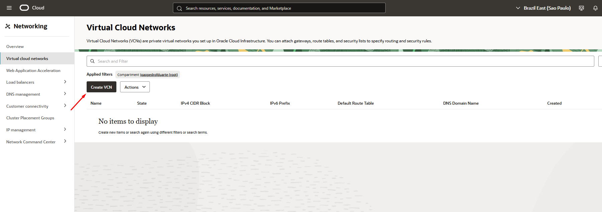
---

Enfim, no painel de configuração da VCN, deixe conforme neste exemplo.

---
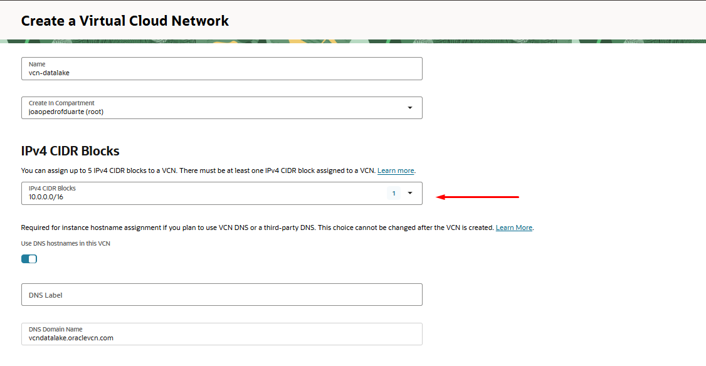
---

### Passo a passo

1. Informe um nome descritivo, por exemplo: `vcn-datalake`.
2. Em **Bloco CIDR IPv4**, insira:
10.0.0.0/16

Este bloco suporta até 65.534 endereços IP privados, suficiente para clusters de pequeno a grande porte.

3. Deixe as demais opções padrão, exceto:
4. **Marque** a opção **"Use DNS hostnames in this VCN"**.
- Isso permitirá que todas as instâncias criadas nesta VCN recebam nomes de host DNS internos.
5. Clique em **Criar VCN** para finalizar.

## 2. Criação da sub-rede pública
Se já não estiver no painel da VCN:

1. No painel da Oracle Cloud Infrastructure (OCI), acesse:
   - **Menu** > **Rede** > **Redes virtuais em nuvem (VCN)**
2. Clique sobre a VCN criada anteriormente (`vcn-datalake`).
3. No menu lateral da VCN, selecione **Sub-redes**.
4. Clique em **Criar Sub-rede**.

### Parâmetros recomendados

- **Nome da sub-rede:** `subnet-pub-datalake`
- **Tipo de sub-rede:** Pública
- **Bloco CIDR IPv4:** `10.0.1.0/24`
- **DNS Label:** `pubdatalake`
- **Gateway de Internet:** Selecione o gateway de internet criado para a VCN (`igw-datalake`)
- **Tabela de rotas:** Selecione a tabela de rotas padrão ou a associada ao gateway de internet
- **Lista de segurança:** Selecione a lista de segurança default do compartimento

> O bloco CIDR `10.0.1.0/24` permite até 254 endereços IP privados, suficiente para a maioria dos clusters de ensino e laboratório.

---
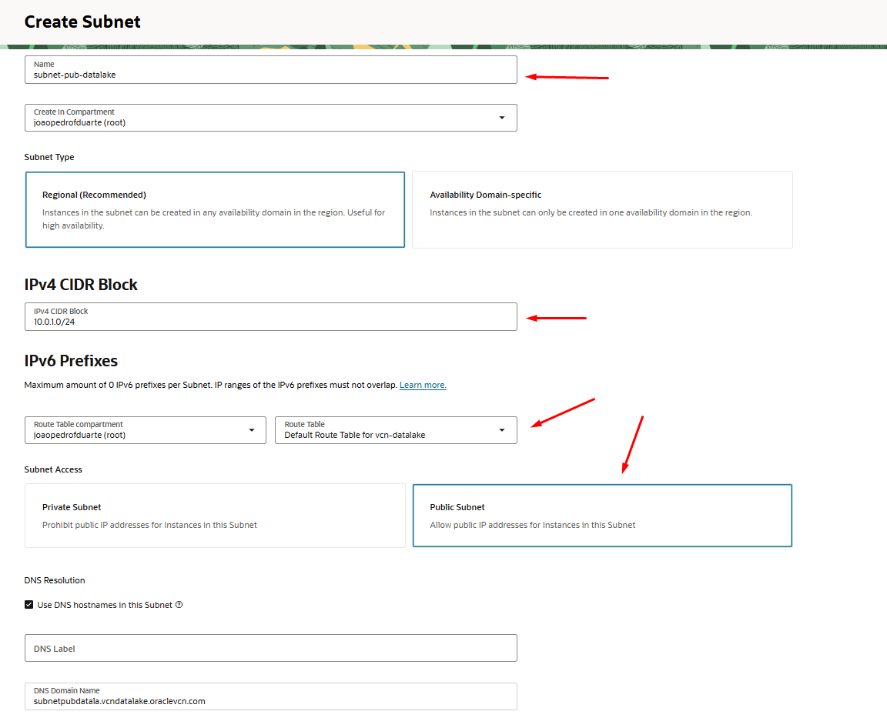
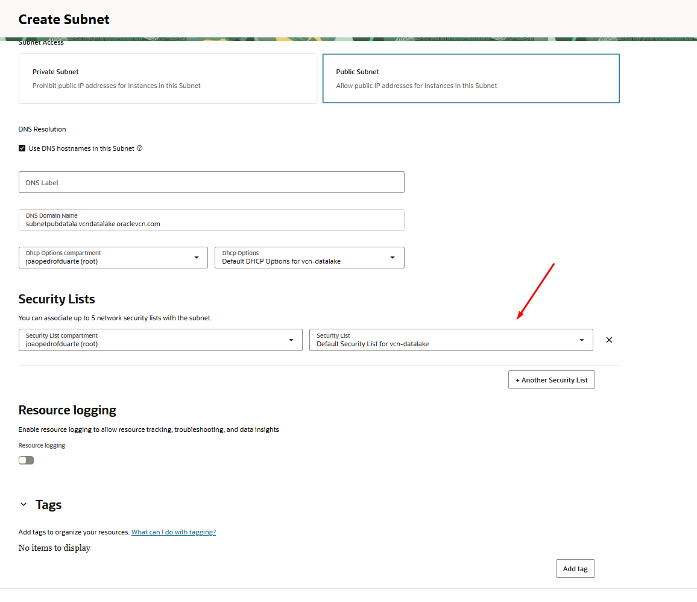
---

## 3. Criação dos Gateways de Internet e NAT

Os gateways de Internet e NAT são componentes essenciais para permitir que as instâncias da VCN tenham comunicação externa, seja de forma pública (Internet Gateway) ou privada (NAT Gateway). O Internet Gateway permite acesso direto à internet para sub-redes públicas, enquanto o NAT Gateway permite que instâncias em sub-redes privadas acessem a internet para atualizações e downloads, sem expor seus IPs diretamente.

Se já não estiver no painel da VCN:

1. No painel da Oracle Cloud Infrastructure (OCI), acesse:
   - **Menu** > **Rede** > **Redes virtuais em nuvem (VCN)**
2. Clique sobre a VCN criada anteriormente (`vcn-datalake`).

---

### 3.1 Criação do Internet Gateway

3. No menu lateral da VCN, selecione **Gateways de Internet**.
4. Clique em **Criar Gateway de Internet**.

#### Parâmetros recomendados

- **Nome do Internet Gateway:** `igw-datalake`
- **Compartment:** Selecione o compartimento do projeto
- **Route Table Association:** Selecione a tabela de rotas padrão da VCN (`Default Route Table for vcn-datalake`)

> O Internet Gateway permite que as instâncias em sub-redes públicas comuniquem-se com a internet, sendo essencial para acesso SSH, atualizações e serviços web.

---

### 3.2 Criação do NAT Gateway

5. No menu lateral da VCN, selecione **NAT Gateways**.
6. Clique em **Criar NAT Gateway**.

#### Parâmetros recomendados

- **Nome do NAT Gateway:** `natgw-datalake`
- **Compartment:** Selecione o compartimento do projeto
- **Ephemeral Public IP Address:** Deixe selecionada a opção padrão (IP público efêmero)
- **Route Table Association:** Selecione a tabela de rotas padrão da VCN (`Default Route Table for vcn-datalake`)

> O NAT Gateway permite que instâncias em sub-redes privadas acessem a internet para atualizações e downloads, sem expor seus IPs privados diretamente à internet.

---
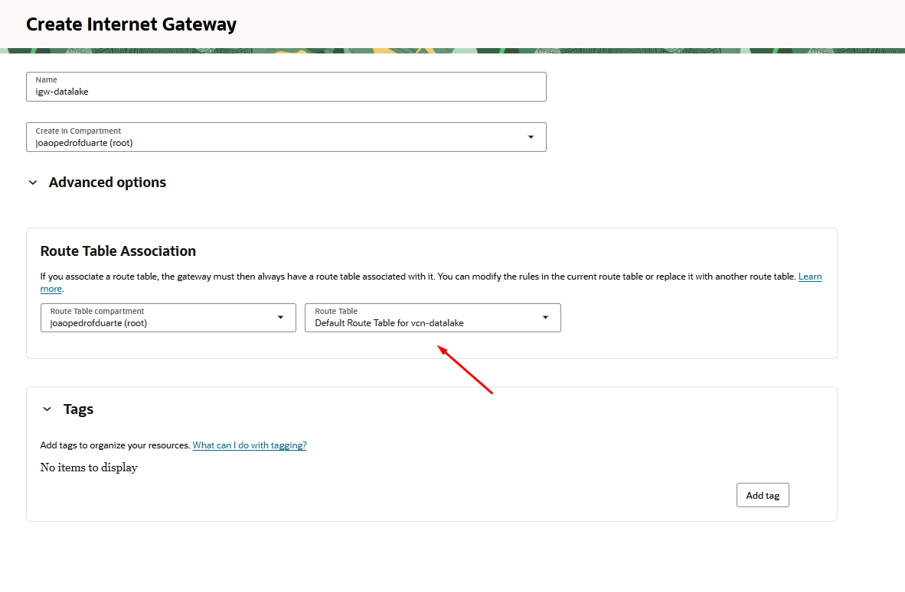
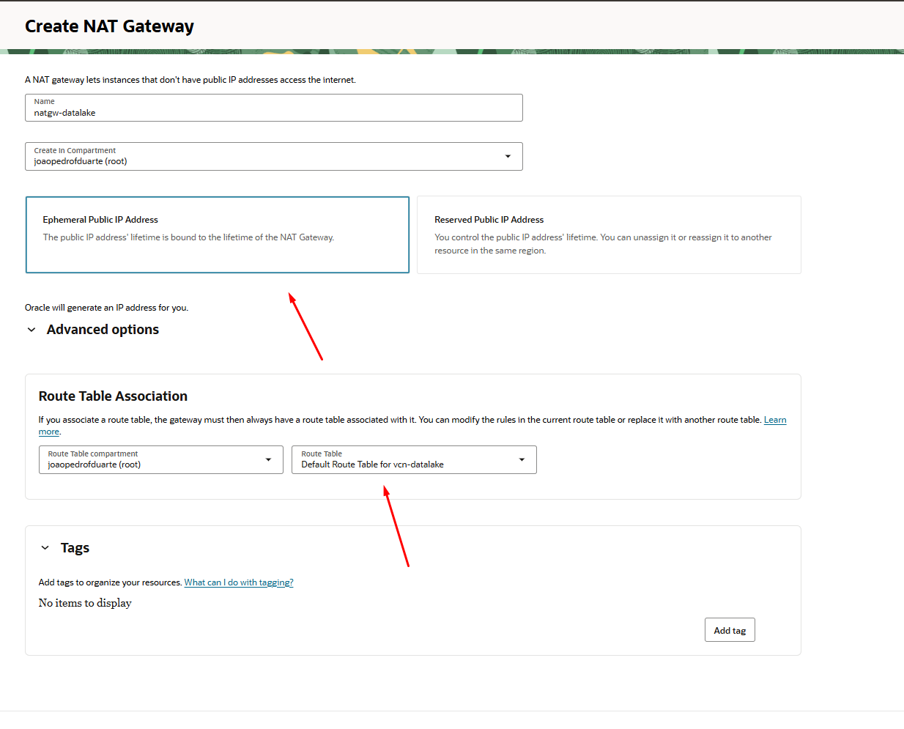
---

### 3.3 Criação do NSG
Um **Network Security Group (NSG)** permite definir regras de segurança de rede de forma mais flexível e granular do que as listas de segurança tradicionais. Com um NSG, você pode criar grupos de instâncias ou outros recursos de rede e aplicar regras de entrada e saída para esses grupos, independentemente da sub-rede em que estão. Vamos usar para as regras de acesso com IP privado nas instâncias criadas, fundamental para acesso entre elas.

1. No painel da Oracle Cloud Infrastructure (OCI), acesse:
   - **Menu** > **Rede** > **VCN**
2. Clique sobre a VCN criada anteriormente e vá em **Security**.
3. Clique em **Criar Network Security Group** para criar um novo NSG.

---

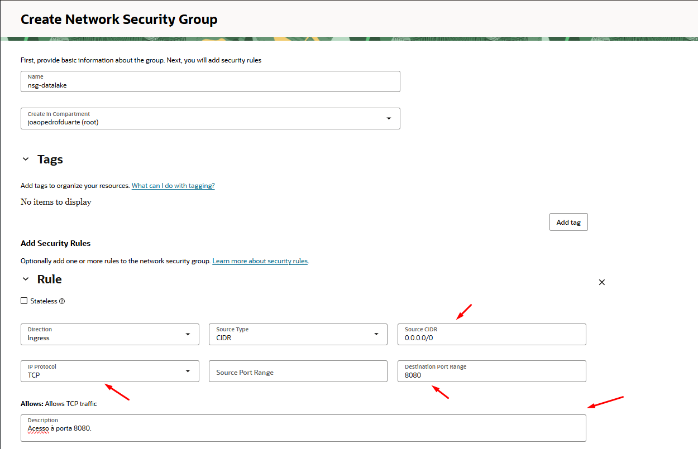
---

> Conforme pode ser visto acima, é necessário colocar também as regras para as porta 8080, 8440 e 8441. No exemplo aparece apenas a porta 8080 mas neste mesmo lugar, adicione regras para as portas 8440 e 8441.

Lembre-se também de conectar a tabela de roteamento da sua subrede ao seu internet gateway, pois assim as máquinas poderão realizar acesso à internet.

## 4. Configuração da tabela de roteamento

No contexto de criação de uma tabela de roteamento, é necessário adicionar uma regra de roteamento para o gateway de internet criado anteriormente. Dessa forma, as máquinas criadas conseguiram realizar acesso à internet.

Para chegar até essa tela, siga os seguintes passos:

1. No painel da Oracle Cloud Infrastructure (OCI), acesse:
   - **Menu** > **Rede** > **VCN**
2. Clique sobre a VCN criada anteriormente e vá em **Routes**.
3. Espere carregar e veja se já existe uma tabela de roteamento padrão. Se existir, clique sobre ela e vá em **Configurações**. (se preferir, pode clicar em **Criar tabela de roteamento** para criar uma nova tabela de roteamento.)
4. Clique em **Criar tabela de roteamento** para criar uma nova tabela de roteamento.

---
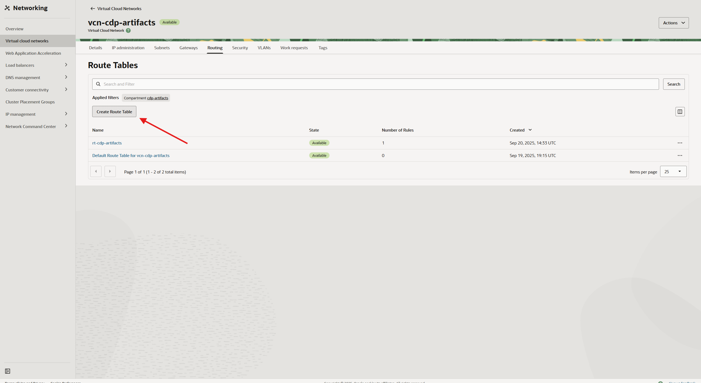

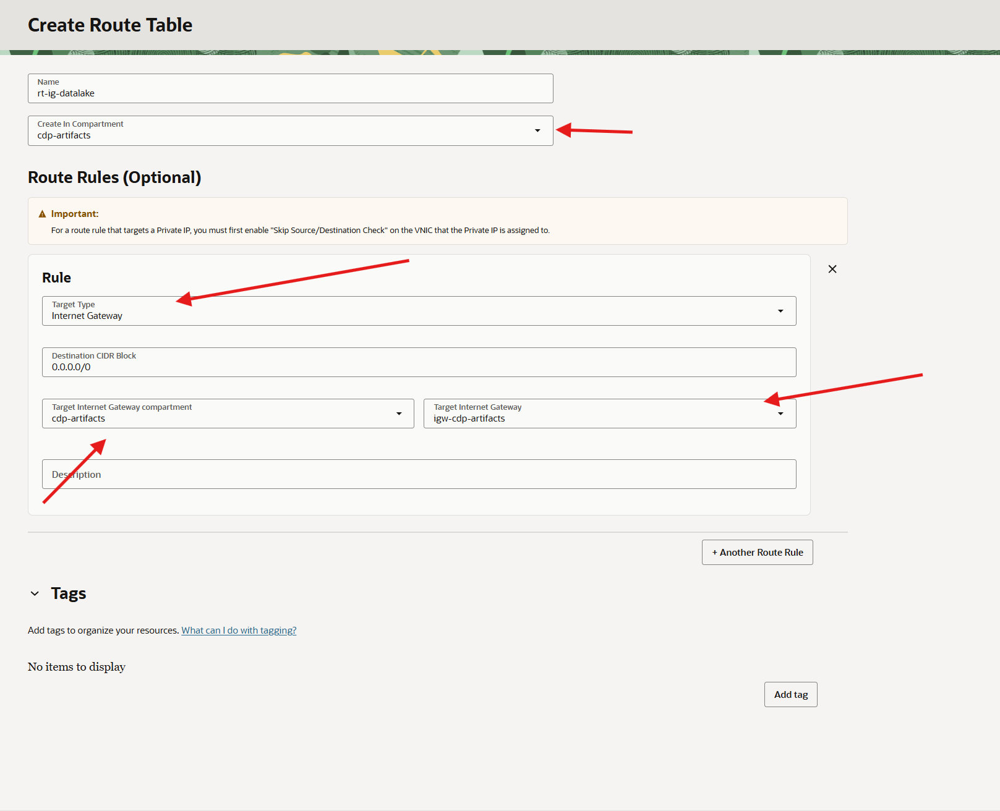
---

## 5. Configuração de Portas Obrigatórias para ODP, Ambari e Hadoop

Para o funcionamento correto do cluster Hadoop/Spark com ODP e Ambari, é necessário liberar o tráfego das seguintes portas nas **Listas de Segurança (Security List)** e, nos **Network Security Groups (NSG)** associados à VCN e às sub-redes do projeto:

| Porta  | Protocolo | Serviço associado           | Função principal                         |
|--------|-----------|----------------------------|------------------------------------------|
| 8080   | TCP       | Ambari Server (Web UI)     | Interface web de administração do cluster|
| 8440   | TCP       | Ambari Agent ↔ Server      | Comunicação segura entre agentes e server|
| 8441   | TCP       | Ambari Agent ↔ Server      | Comunicação segura entre agentes e server|

### Como configurar

1. **Acesse a Security List** ou o **NSG** associado à sua sub-rede pública/privada.
2. Adicione regras de entrada (Ingress Rules) permitindo tráfego TCP nas portas 8080, 8440 e 8441, conforme exemplo abaixo:

#### Exemplo de regra para Security List

| Tipo de Tráfego | Protocolo | Porta de Destino | Origem           | Descrição                     |
|-----------------|-----------|------------------|------------------|-------------------------------|
| TCP             | TCP       | 8080             | 0.0.0.0/0        | Ambari Web UI                 |
| TCP             | TCP       | 8440             | 0.0.0.0/0        | Ambari Agent/Server           |
| TCP             | TCP       | 8441             | 0.0.0.0/0        | Ambari Agent/Server           |

3. Já assumo que fez o procedimento para NSG no passo anterior, caso não, verifique novamente e realize a adição no caminho para encontrar a NSG.

---
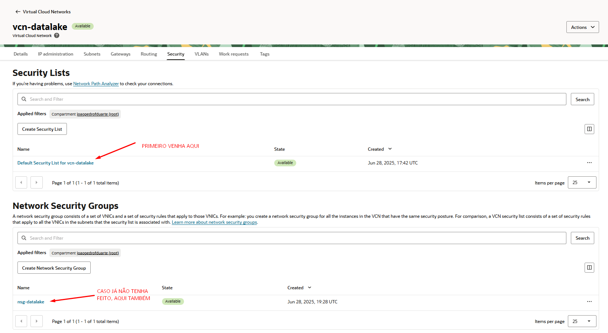
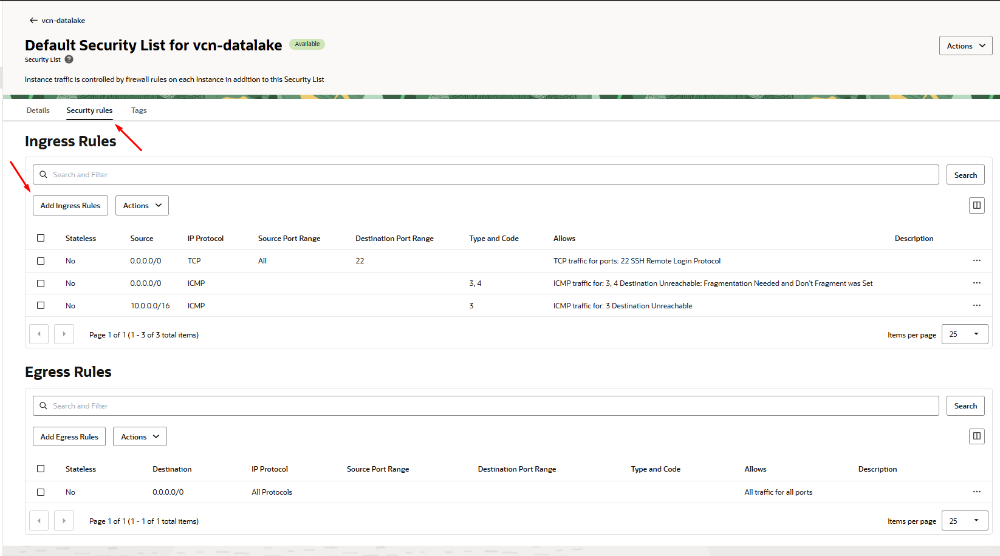
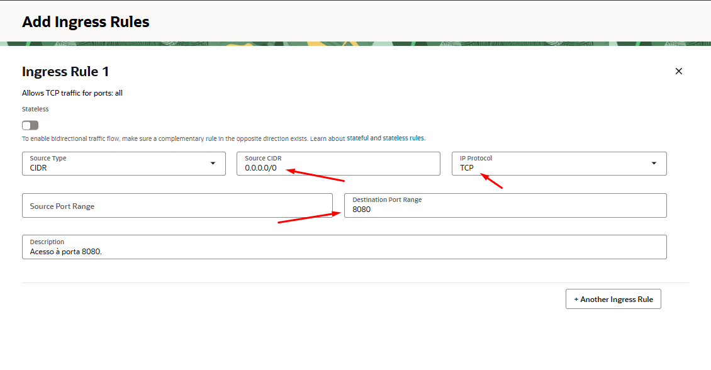
---

Com base nas imagens anteriores, crie, exatamente da mesma forma, as regras de **ingress** para as portas 8440 e 8441.

## 6. Verificação de acesso da tabela de roteamento

Verifique ainda se na tabela de roteamento associada à VCN e à sua subnet, normalmente a default, está com essa regra abaixo. Caso não esteja, é importante que o faça, pois se não estiver, não será possível acessar a internet com nenhuma das máquinas, como também, nem acessá-las via OpenSSH.

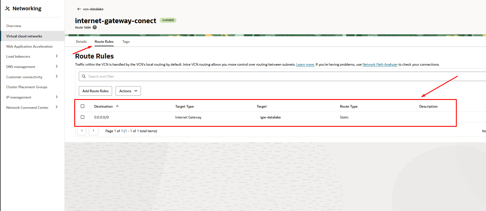

