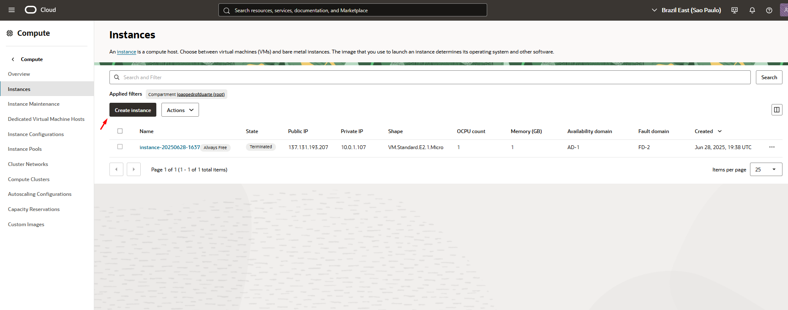
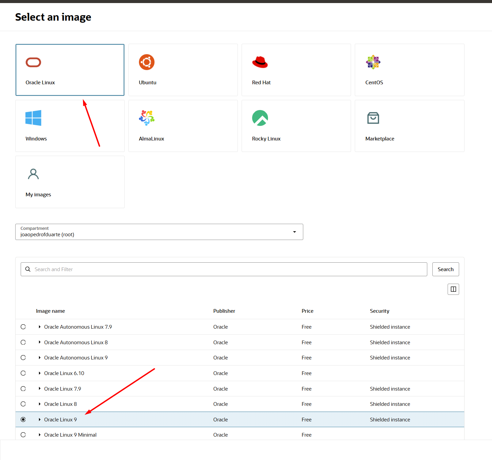
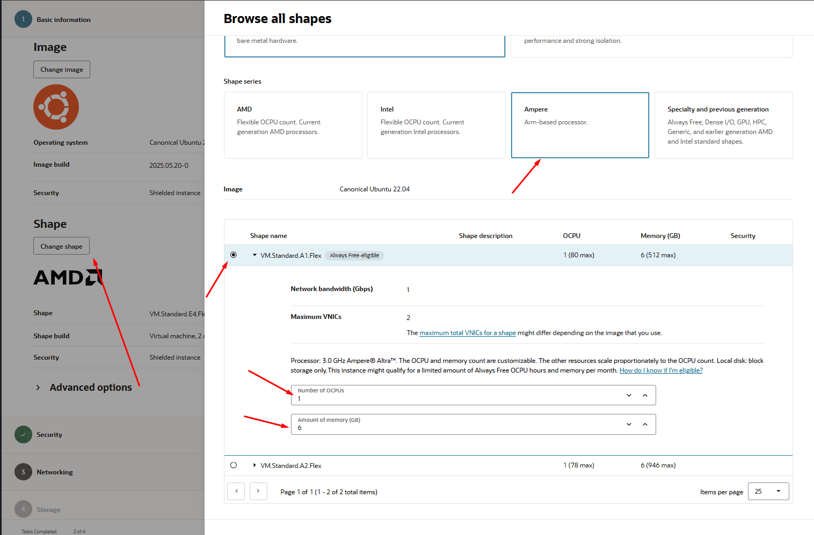
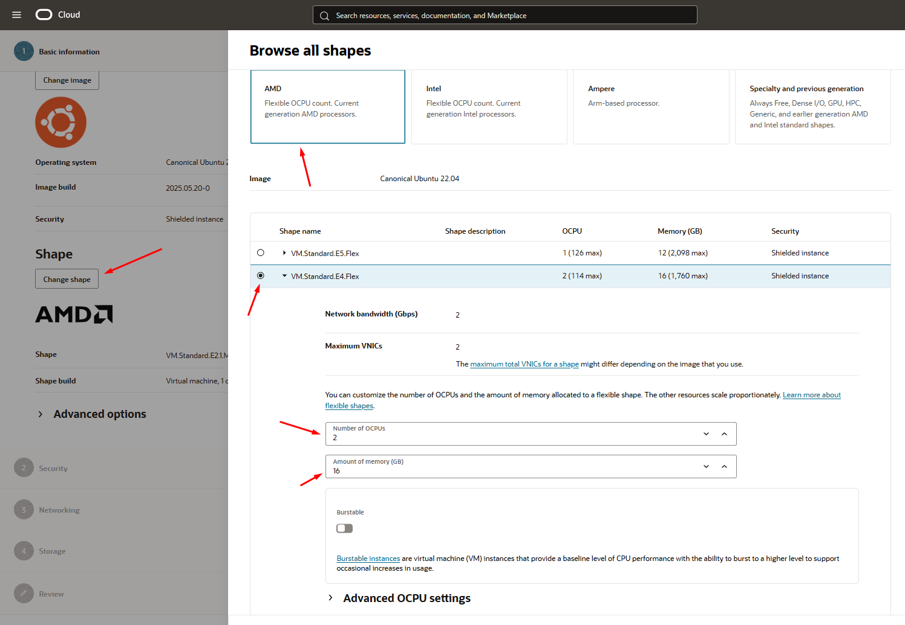
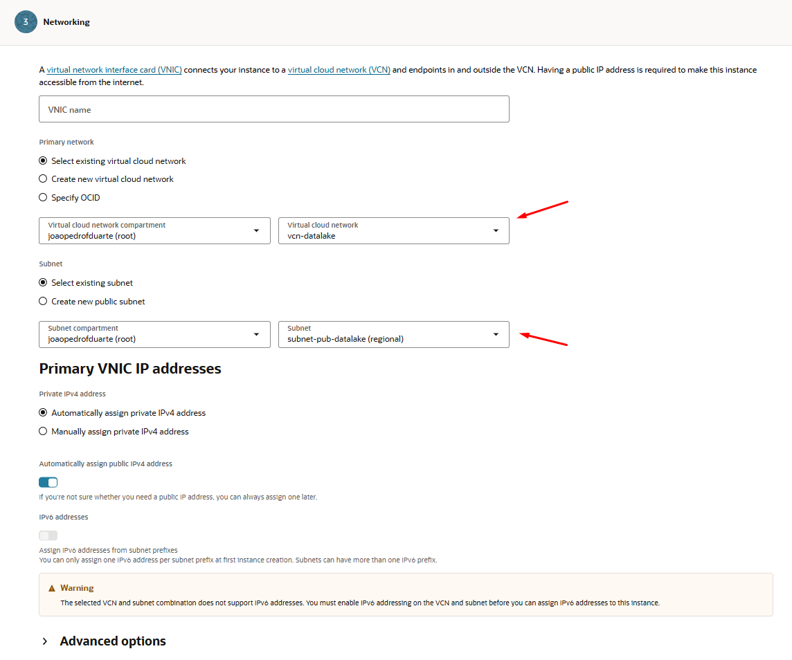
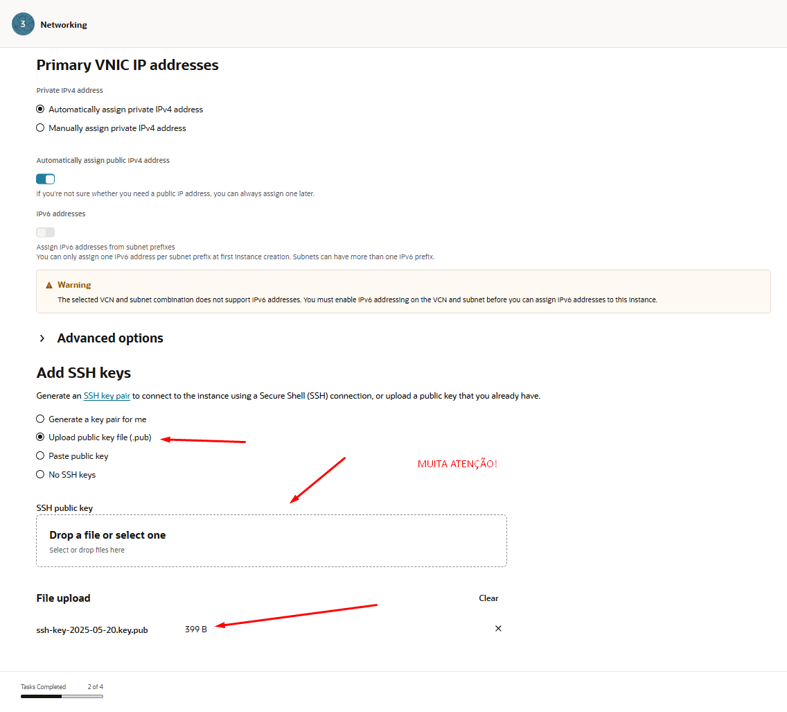
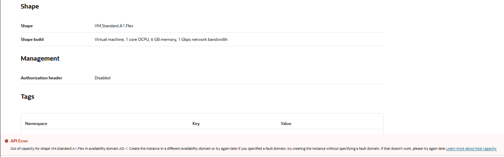
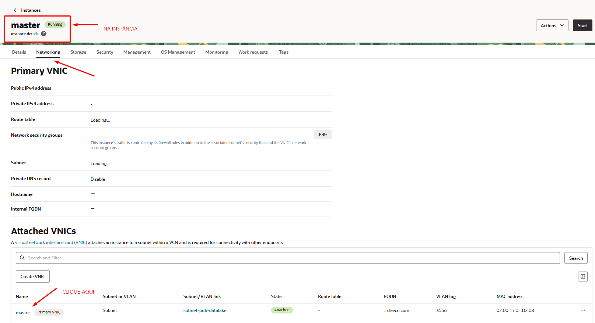
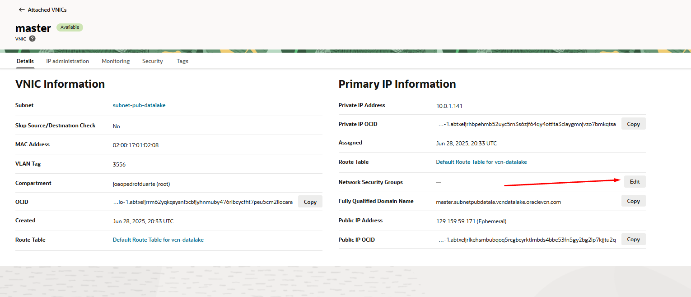
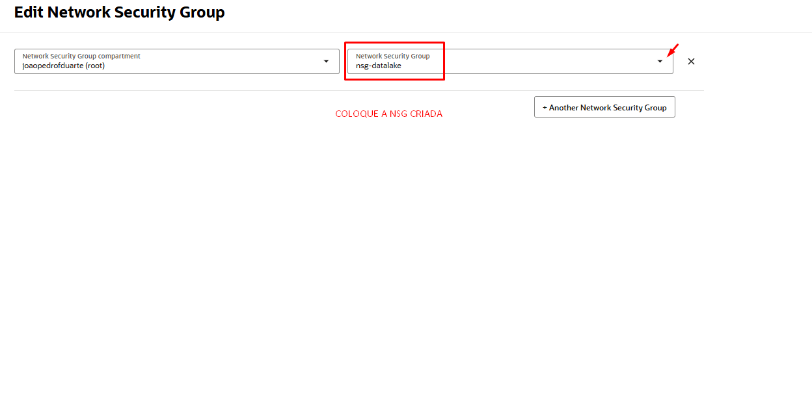

# 03 • Provisionamento das Máquinas Virtuais

## 1. Geração de Chaves SSH para Acesso às Instâncias

Para acessar as máquinas virtuais (VMs) do cluster na OCI de forma segura, é necessário gerar um par de chaves SSH (pública e privada). O procedimento abaixo cobre tanto usuários de **Windows** (via PowerShell) quanto de **Linux**.

---

### 1.1. Usuários Windows (PowerShell)

1. Abra o **PowerShell**:
   - Clique no menu Iniciar, digite "PowerShell", clique com o botão direito e escolha "Executar como administrador".

2. No PowerShell, digite o comando abaixo e pressione Enter:

```bash
ssh-keygen -b 4096
```

- Quando solicitado pelo "file in which to save the key", pressione **Enter** para aceitar o local padrão (`C:\Users\<SeuUsuario>\.ssh\id_rsa`).
- Nos demais passos também apenas presione **Enter**.

3. Ao final, serão criados dois arquivos na pasta `C:\Users\<SeuUsuario>\.ssh\`:
- `id_rsa` (chave privada, **NUNCA compartilhe**)
- `id_rsa.pub` (chave pública, que será usada nas VMs)

4. Para visualizar e copiar sua chave pública:

```bash
notepad C:\Users<SeuUsuario>.ssh\id_rsa.pub
```
### 1.2. Usuários Linux

1. Abra o terminal.
2. Execute o comando abaixo:

```bash
ssh-keygen -t rsa -b 4096 -C "seu_email@exemplo.com"
```
- Quando solicitado pelo "Enter file in which to save the key", pressione **Enter** para aceitar o local padrão (`/home/seuusuario/.ssh/id_rsa`).
- Se desejar, defina uma senha para a chave ou apenas pressione **Enter** para deixar em branco.

3. Serão criados dois arquivos em `~/.ssh/`:
- `id_rsa` (chave privada)
- `id_rsa.pub` (chave pública)

4. Para visualizar e copiar sua chave pública:

```bash
cat ~/.ssh/id_rsa.pub
```

### 1.3 Contexto geral de projeto
Serão criadas **4 instâncias**:

| Função  | Shape sugerido | Sistema Operacional |
|---------|----------------|---------------------|
| master  | VM.Standard.E4.Flex (1 OCPU, 6 GB) / VM.Standard.A1.Flex (1 OCPU, 6 GB) | Oracle Linux 9 |
| node1  | VM.Standard.E4.Flex (1 OCPU, 6 GB) / VM.Standard.A1.Flex (1 OCPU, 6 GB)  | Oracle Linux 9 |
| node2  | VM.Standard.E4.Flex (1 OCPU, 6 GB) / VM.Standard.A1.Flex (1 OCPU, 6 GB)  | Oracle Linux 9 |
| node3  | VM.Standard.E4.Flex (1 OCPU, 6 GB) / VM.Standard.A1.Flex (1 OCPU, 6 GB)  | Oracle Linux 9 |

## 2. Processo de criação das instâncias
Uma **instância** na Oracle Cloud Infrastructure (OCI) é uma máquina virtual (VM) ou bare metal criada a partir de um shape (configuração de CPU, memória e rede), utilizada para executar sistemas operacionais, aplicações e serviços diversos. No contexto deste projeto, cada nó do cluster Hadoop/Spark é representado por uma instância, podendo ser master ou worker.

Instâncias podem ser configuradas com diferentes recursos de armazenamento, conectividade de rede (VNICs), chaves SSH para acesso seguro e associadas a grupos de segurança (NSG) e listas de segurança.

### 2.1 Caminho para visualizar e gerenciar instâncias

1. No painel da Oracle Cloud Infrastructure (OCI), acesse:
   - **Menu** > **Compute** > **Instances**

---

---

Neste menu, dê o nome de **master** para a instância e mude a imagem para a do **Oracle Linux 9**

---

---

Selecione conforme a imagem as informações de shape, com a qtda de OCPU e memória adequados. Recomendo que inicialmente use o shape **VM.Standard.A1.Flex (1 OCPU, 6 GB)** que estará em **Ampere**. 

---


---

Em **Segurança**, mantenha como está. Em **Network**, as opções já serão marcadas automaticamente, mas caso não, seriam essas as corretas. Muita atençâo à adicionar, ainda nessa etapa, a chave SSH que você criou, à sua instância, pois caso contrário, não conseguirá acessá-la futuramente.

---


---

Nas etapas de **Storage** e **Review** mantenha exatamente como estão e finalize o processo. Caso ocorra um erro como este abaixo, é necessário trocar o shape para outro com disponibilidade, como no caso do outro que usamos como exemplo. É importante que mantenha o número de OCPU's e memória.

---

---

Finalizando essa configuração, sua máquina master estará pronta enfim. Agora é necessário executar exatamente o mesmo processo para as demais máquinas, os **nodes** de 01 à 03.

### 2.1 Adição das máquinas à NSG

Agora é necessário, antes de realizar o acesso via openSSH às máquinas, adicioná-las à NSG. Repita o caminho anterior até sua instância, e clique no nome da VM criada. Reproduza os passos das imagens abaixo.

---



--

Com essas ações concluídas, enfim será possível agora acessar via openSSH as máquinas criadas e dar início aos passos de configuração do ambiente do cluster Hadoop com ODP/Ambari.

Nos próximos documentos dessa parte do projeto coloco mais algumas informações pertinentes de possíveis problemas e questões de boas práticas e conhecimento geral. 