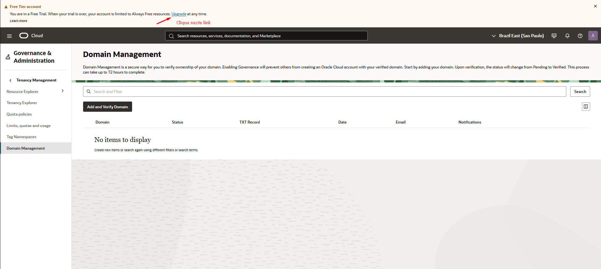
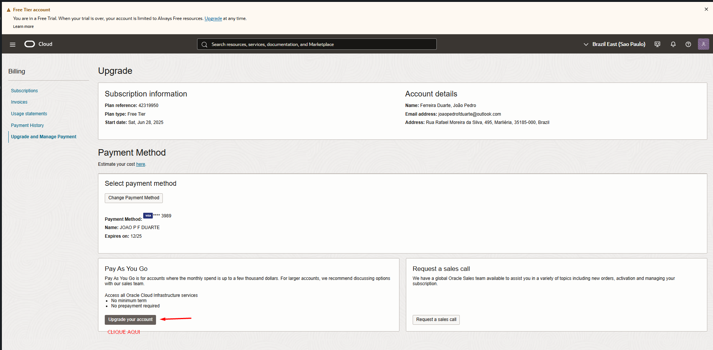
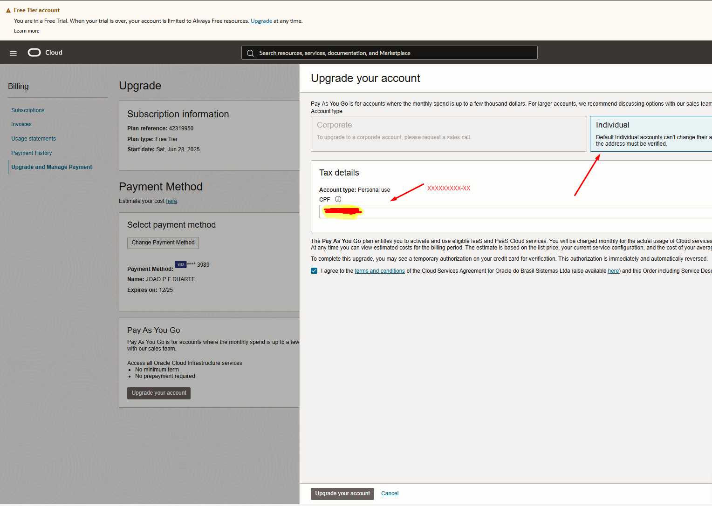
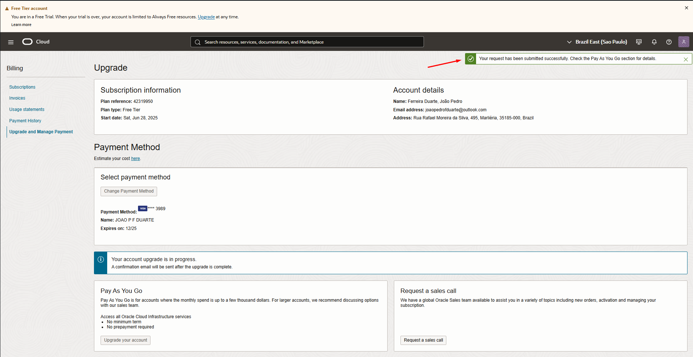
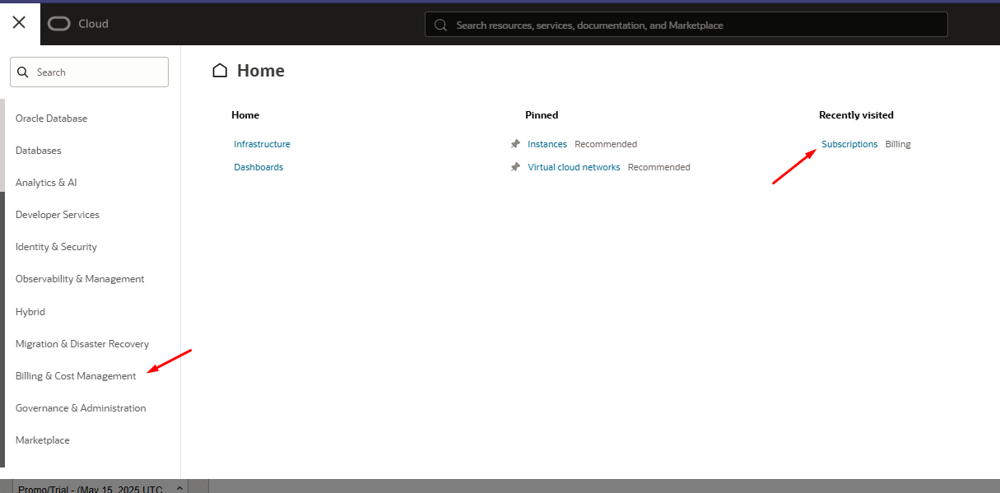
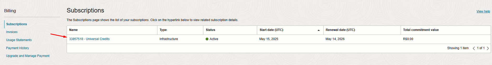
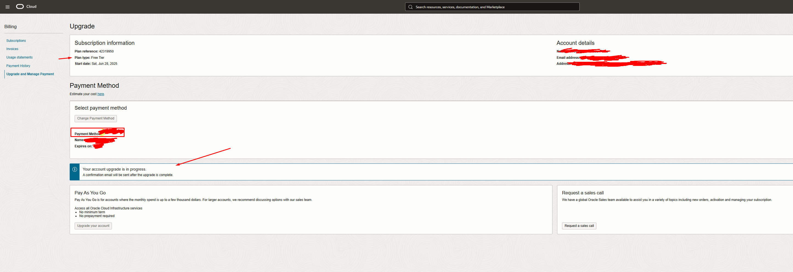
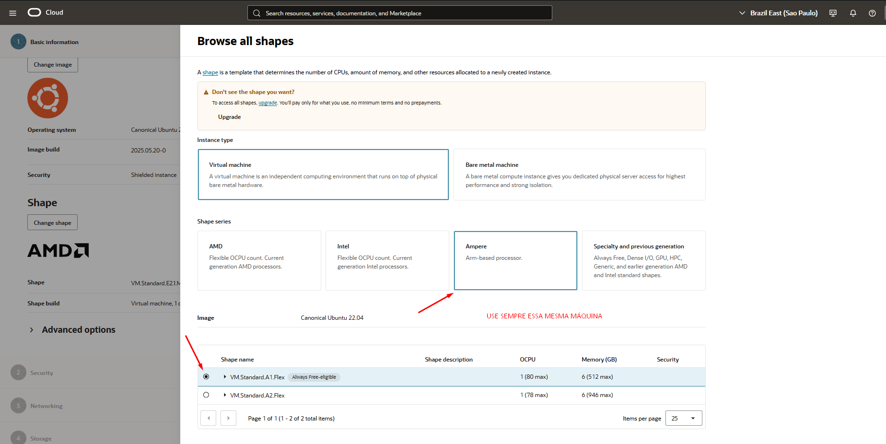

# 03.1 • Provisionamento das Máquinas Virtuais Free Tier

Este espaço é dedicado para os processos de criação de máquinas virtuais com máquinas free tier na OCI. Neste caso, é apenas um procedimento útil de ser abordado antes da criação das máquinas em si, portanto, caso opte por criar o cluster inteiramente em máquinas free tier ou pelo menos com certa quantidade de máquinas free tier, recomendo que realize os processos daqui antes.

## Upgrade de conta

### Processo de upgrade
Inicialmente, ainda deve aparecer para você este link neste banner abaixo. Caso não esteja aparecendo, teste entrar por este link [Acesso à upgrade e pagamento](https://cloud.oracle.com/invoices-and-orders/upgrade-and-payment)

---

---

Na tela seguinte, ainda conforme a próxima imagem, clique neste seguinte link:

---

---
Em seguida, preencha adequadamente o campo de CPF, selecione a caixa seletora que diz "Individual" e por fim confirme sua operação. Observo aqui que à depender de já ou não ter colocado seu cartão de crédito na conta, pode ocorrer de pedir pela inserção do cartão. Neste caso, este já foi inserido na etapa de criação da conta.

---

---

Por fim, aparecerá para você ao final de sua configuração, a seguinte mensagem ao topo da conta, num banner:

---

---

É importante que você coloque seu cartão de crédito na OCI, como também verifique se o seu plano está como o de acordo ao debaixo. Fazendo o mesmo processo pelo link prévio:

---

---

---

---

Caso já esteja, pode manter dessa forma, assim aumenta as chances de consegui realizar a criação com máquinas free tier. Em upgrade, ainda leva um tempo para que o status da conta mude, então basta apenas aguardar. Em pesquisa, verifiquei que pode levar de *15min à 24h* para ser concluído.

## Diferenças quanto ao processo anterior (Máquina à ser selecionada)
O que torna este processo distinto do anterior, é apenas um detalhe, no caso, a máquina a ser selecionada, deve ter uma marcação como "always free eligible", conforme a imagem abaixo. Da mesma forma como na imagem abaixo, em Ampere, selecione a máquina *VM.Standard.A1.Flex
*, pois é a configuração gratuita com os requisitos mínimos que precisamos para montagem do cluster.

---

---

Outro ponto interessante seja talvez consultar a bibliografia abaixo para mais informações quanto à planos da OCI e suas formas de cobrança.

[Oracle Cloud - Preços](https://www.oracle.com/br/cloud/pricing/)

Como observação final dessa etapa, pode ocorrer de o upgrade de sua conta levar certo tempo para ocorrer, não é um processo imediato.
