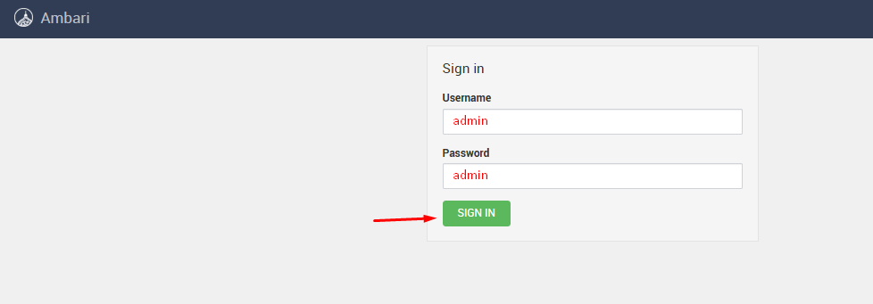
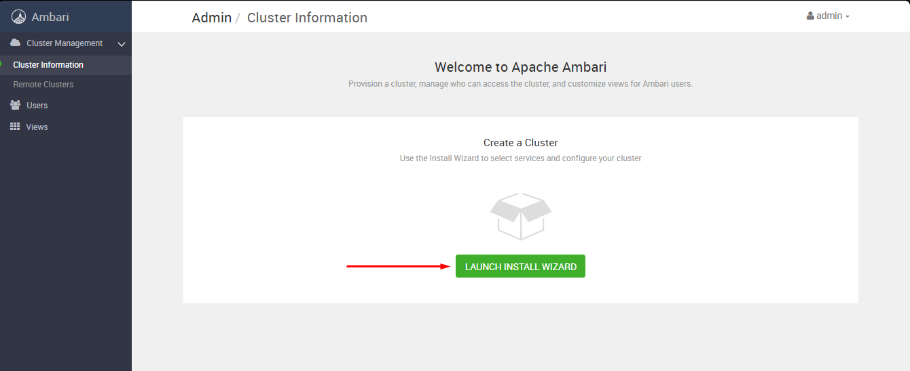
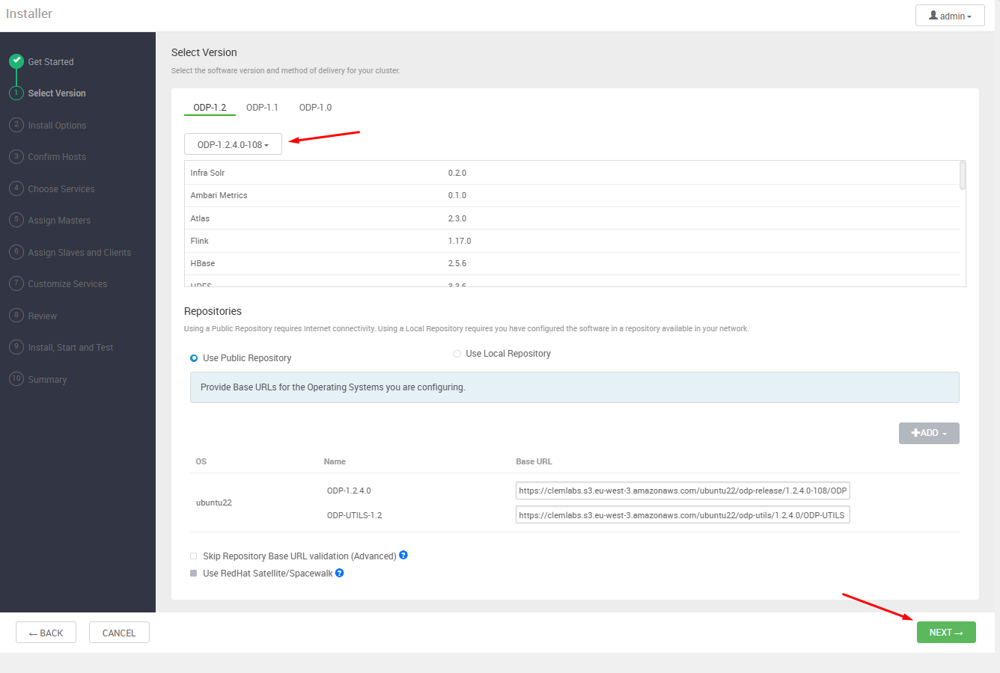
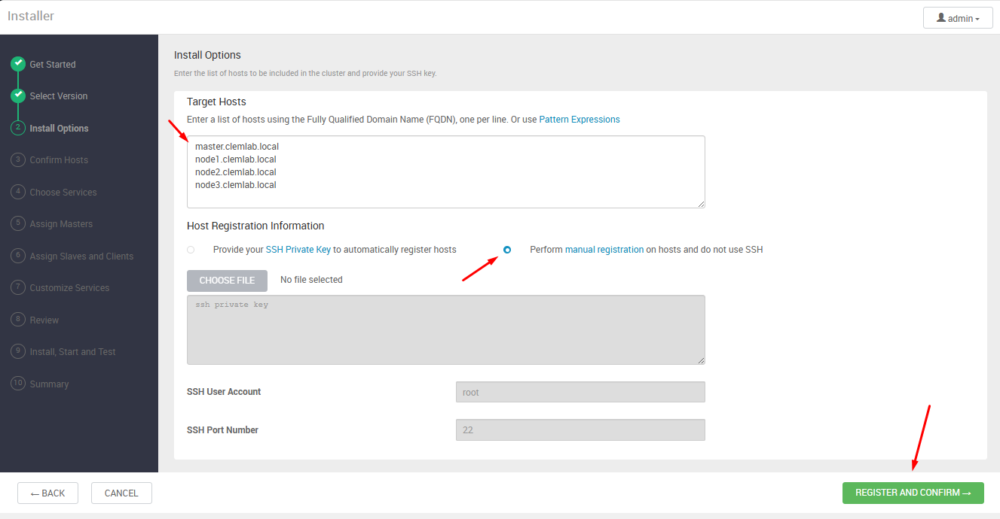
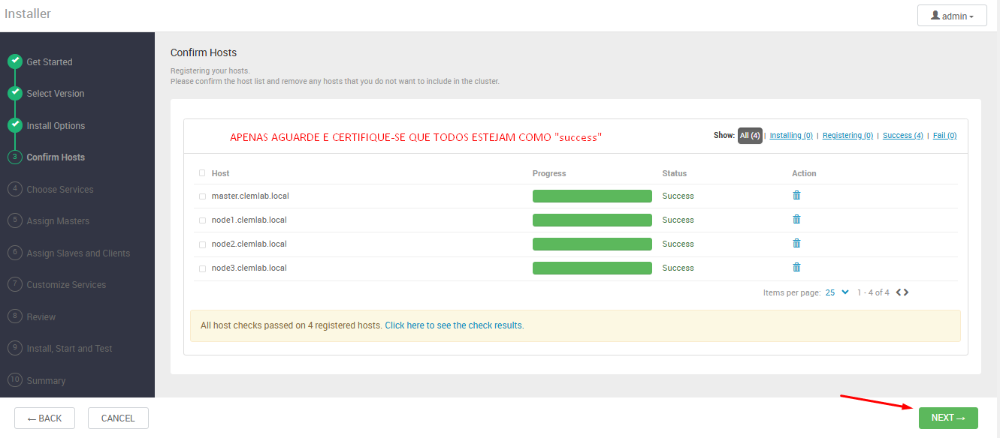
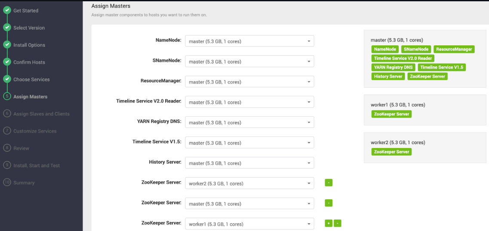
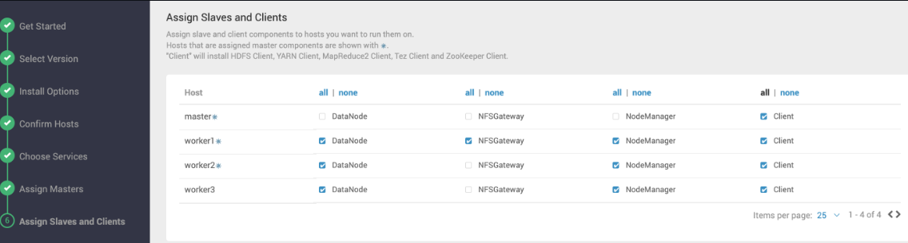
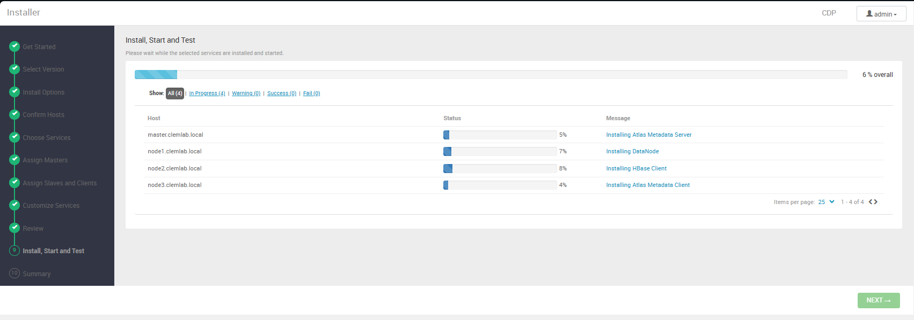
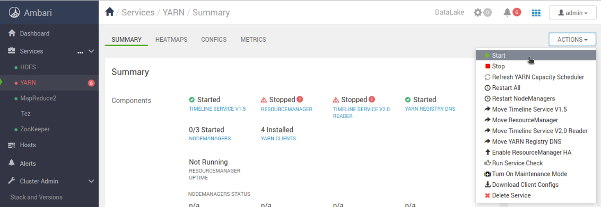

# 03 – Configuração do Ambari pela interface

Conforme o que foi desenvolvido no passo anterior, agora digite em seu navegador o endereço IPv4 da sua máquinas *master* na porta 8080. Um socket como este: **<ip_master>:8080**. Dessa forma verá como disponível a tela abaixo:

---

---

Tendo realizado o login agora iniciam-se as etapas de configuração referentes ao desenvolvimento do cluster conforme suas necessidades de uso. A seguinte tela estará disponível para que você acesse:

---

---

## Início do processo de configuração do Cluster
Aqui apenas escolhemos um nome para Cluster que estamos montando, neste sentido, por questões de padrão, manterei como **CDP**.

---

---

## Adicionando a Stack ODP customizada via VDF no Ambari

Após nomear o cluster na interface do Ambari, o próximo passo é selecionar a distribuição da stack que será utilizada. Como o ODP não aparece na listagem pública por padrão, será necessário **adicionar manualmente o arquivo VDF (Version Definition File)** referente ao stack ODP fornecido pela Clemlab.

### Passo a passo para adicionar o VDF customizado

1. **Na tela "Select Version" (Selecionar Versão):**
   - Clique em **"Add Version"** (Adicionar Versão) ou **"Adicionar versão personalizada"**, conforme a interface.

2. **No campo "Version name" (Nome da Versão):**
   - Defina um nome amigável para identificar a stack. Exemplo: `ODP 1.2.2.0 (build 128)`.

3. **No campo de Upload (Add version):**
   - Faça upload do arquivo ODP-VDF.xml (ODP-1.2.2.0-128). Utilize o arquivo disponível no repositório em `assets/odp-vdf/ODP-VDF.xml`.

4. **Clique em "Next" (Avançar) ou "OK", conforme disponível.**
   - O Ambari fará o download e validação do arquivo VDF.
   - Aguarde até que a stack ODP apareça listada entre as versões disponíveis.

5. **Selecione a stack recém-adicionada ("ODP 1.2.2.0").**

6. **Prossiga com o assistente de configuração normalmente.**
   - Siga para as próximas telas onde será definida a origem dos repositórios, serviços e mapeamento dos nós.

Deve ficar como na imagem abaixo:

---

---

## Registro Manual de Hosts na Interface do Ambari
Apenas para fins de verificação, execute os comandos abaixo em sua máquina master e verifique se retorna "OK" **para todos**.

```bash
ssh opc@master.cdp "hostname -f && echo OK"
ssh opc@node1.cdp "hostname -f && echo OK"
ssh opc@node2.cdp "hostname -f && echo OK"
ssh opc@node3.cdp "hostname -f && echo OK"
```

Após validar o acesso SSH sem senha entre o nó master e todos os demais nós do cluster usando seus nomes FQDN, siga para os passos abaixo:

### Tela "Install Options" – Opções de Instalação

Na etapa "Install Options" do instalador do Ambari:

1. **Target Hosts**
   - Insira uma lista dos nomes FQDN de todos os nós do cluster, um por linha (conforme definido previamente).
     Exemplo:
     ```
     master.cdp
     node1.cdp
     node2.cdp
     node3.cdp
     ```
2. **Host Registration Information**
   - Selecione a opção **"Perform manual registration on hosts and do not use SSH"** (Registrar manualmente os hosts e não usar SSH automático).
   - **Não é necessário** informar chave privada SSH, usuário ou porta, pois o acesso já foi previamente configurado manualmente.
3. Clique em **REGISTER AND CONFIRM** para prosseguir.

Deve ficar conforme a imagem abaixo:

---

---

## Confirmação dos Hosts Registrados no Ambari

Após inserir os FQDNs dos nós do cluster e optar pelo registro manual, o Ambari realiza a verificação do status de cada host na etapa "Confirm Hosts".

### O que esperar nesta etapa

- O Ambari irá checar automaticamente a conectividade com os agentes instalados em cada nó.
- Se tudo foi configurado corretamente (`ambari-agent` em execução, hostnames definidos e acesso de rede funcional), todos os nós aparecerão listados com o status **"Success"**, conforme mostra a tela abaixo:

---

---

Na imagem, todos os nós (`master.cdp`, `node1.cdp`, `node2.cdp`, `node3.cdp`) foram registrados com sucesso e os "host checks" passaram sem falhas.

Quando todos os hosts apresentarem o status **Success**, a infraestrutura básica do cluster está pronta para a definição dos serviços e papéis de cada nó.

## Escolha dos Componentes do Cluster

Após a confirmação dos hosts do cluster, a próxima etapa consiste na **seleção dos componentes** que serão instalados e configurados em cada nó, conforme as necessidades do seu ambiente. Essa decisão é fundamental, pois influencia diretamente nos recursos disponíveis para processamento, ingestão, análise e governança de dados.

### Componentes selecionados para este ambiente

Para o setup inicial (base), selecione apenas os seguintes serviços:

- **ZooKeeper**: Coordenação e sincronização dos serviços distribuídos.
- **HDFS**: Armazenamento distribuído base do ecossistema.
- **YARN + MapReduce2**: Gerenciamento de recursos e processamento distribuído.
- **Tez**: Engine DAG sobre YARN, otimiza performance do Hive e pipelines no Hadoop.

Observações:
- Esta seleção reflete a base adotada no blueprint do ambiente cdp.dev.br para garantir compatibilidade e evitar conflitos.
- Os demais componentes (ex.: Hive, Ambari Infra Solr, Ranger, Kafka, HBase, NiFi, Spark3, etc.) deverão ser adicionados após a conclusão do setup inicial, um por vez, seguindo a ordem recomendada no documento `03.1-configuracao-servicos-componentes.md`. As configurações específicas de cada um serão tratadas no documento `04-pos-instalacao.md`.

---

### Referência de componentes

Para entender o papel de cada componente, suas funcionalidades e os cenários indicados para uso, acesse o arquivo complementar abaixo, onde está disponível uma tabela detalhada de todos os serviços suportados pela distribuição ODP:

- [`docs/02-ODP/03.0-configuracao-servicos-componentes.md`](03.0-configuracao-servicos-componentes.md)

Neste documento complementar, você encontrará:

- Nome de cada componente
- Descrição resumida da função
- Situações principais para aplicação
- Dependências e recomendações de uso em diferentes perfis de cluster

## Distribuição dos Papéis de Master – Assign Masters

Durante o assistente de configuração do Ambari, após a seleção dos componentes, você será direcionado à tela **Assign Masters**, responsável por atribuir os papéis de "master" de cada serviço do cluster aos diferentes nós.

### O que deve ser feito nesta etapa

- Atribua cada função de master seguindo o modelo apresentado na interface, replicando a seleção da imagem de referência.
- Esta distribuição garante o balanceamento das cargas e a alta disponibilidade dos principais serviços.

---

### Distribuição recomendada dos componentes (setup inicial)

| Função                       | Nó designado             |
|------------------------------|--------------------------|
| NameNode                     | master.cdp        |
| Secondary NameNode           | master.cdp        |
| ResourceManager              | master.cdp        |
| History Server               | master.cdp        |
| App Timeline Server          | master.cdp        |
| Timeline Service V2.0 Reader | master.cdp        |
| YARN Registry DNS            | master.cdp        |
| ZooKeeper Server (1)         | master.cdp        |
| ZooKeeper Server (2)         | node1.cdp         |
| ZooKeeper Server (3)         | node3.cdp         |

> **Atenção:**
> Não altere esta configuração recomendada — ela foi desenhada para garantir distribuição de carga, robustez na operação e boa prática em ambientes de clusters Hadoop/Spark.

Deve ficar exatamente conforme esse imagem:

---

---

### Como selecionar

1. **Para cada serviço listado**, utilize o menu suspenso da coluna correspondente na interface para escolher o mesmo nó que aparece como selecionado na imagem.
2. **Não pule nenhum serviço.** Confirme que todos estão atribuídos aos mesmos nós indicados.
3. Após finalizar todas as seleções, avance para a próxima etapa do assistente.

## Etapa: Atribuição de Slaves e Clientes – Assign Slaves and Clients

Na sequência do assistente de configuração do Ambari, após definir os masters, chega-se à etapa **Assign Slaves and Clients**. Aqui você irá especificar quais nós do cluster irão executar os papéis de slave (DataNode, NodeManager, etc.) e quais receberão componentes cliente.

### O que fazer nesta etapa

Para o setup inicial, marque:
- DataNode: em `node1.cdp`, `node2.cdp` e `node3.cdp`.
- NodeManager: em `node1.cdp`, `node2.cdp` e `node3.cdp`.

Os componentes cliente (HDFS/YARN/Tez) serão atribuídos automaticamente conforme a seleção dos serviços. Não inclua componentes de serviços ainda não instalados (ex.: Spark3, Hive) nesta etapa; eles serão adicionados posteriormente.

---

---
## Customização de Serviços

Para o setup inicial com os serviços base (ZooKeeper, HDFS, YARN + MapReduce2 e Tez), ajuste somente o essencial nesta etapa:

- HDFS
  - Replicação padrão (dfs.replication): defina 3 se houver pelo menos três DataNodes; caso contrário, utilize 1 ou 2.
  - Diretórios de dados: confirme/ajuste os caminhos para NameNode/DataNode e garanta que existem com permissão adequada (ex.: `/hadoop/hdfs/namenode`, `/hadoop/hdfs/datanode`).
- YARN
  - Verifique os limites de memória/vcores do NodeManager conforme os recursos das VMs (ex.: shapes A1 com ~6 GiB RAM); mantenha valores conservadores no início.
  - Ative/revise Log Aggregation se necessário para facilitar troubleshooting.
- MapReduce2
  - Confirme `mapreduce.framework.name=yarn` (padrão) e o local do Job History (History Server) no HDFS.
- Tez
  - Mantenha as configurações padrão inicialmente; confirme `tez.use.cluster.hadoop-libs=true` quando aplicável.

Validação após ajustes
- Execute os Service Checks de HDFS e YARN no Ambari (Actions → Run Service Check) e corrija eventuais alertas antes de avançar.
- Garanta que as portas e firewall estão liberadas conforme “00-prérequisitos.md” e que o SELinux está em modo permissivo durante a instalação inicial.

Observações importantes
- As credenciais e configurações de serviços adicionais como Hive, Ambari Infra Solr, Ranger, Kafka, HBase, NiFi e Spark3 serão definidas quando esses serviços forem instalados, um por vez, seguindo a ordem recomendada em `03.1-configuracao-servicos-componentes.md` e com detalhes práticos no documento `04-pos-instalacao.md`.
- Recomendamos exportar o blueprint do cluster ao final do wizard para versionamento e auditoria (Ambari → Export Blueprint).

É comum que nessa etapa de instalação dos componentes hajam problemas de instalação, portanto, existem alguns procedimentos recomendados de instalação para serem executados com o objetivo de tornar mais simples o processo. Isso exigirá que acesse via SSH sua máquina master e as demais máquinas nós.

Uma dica, como já realizou a configuração via SSH entre as próprias máquinas, é interessante então que apenas use os comandos de SSH dentro da própria master para acessar as demais máquina, como no exemplo abaixo:

```bash
ssh master.cdp
ssh node1.cdp
ssh node2.cdp
ssh node3.cdp
```

Para avançar com a instalação dos demais serviços na ordem recomendada e aplicar ajustes pós-instalação, siga o documento abaixo:

- [`04-pos-instalacao.md`](04-instalacao-interface.md)

É muito comum que os erros vistos acima acontecem, como também outros que talvez possam não eestar aí, caso ocorra, abra um issue no GitHub para que acrescente à base de conhecimento.

---

---

Ao final deste processo, possivelmente o cluster estará com os componentes instalados, porém ainda sem serem inicializados devido à problemas que vamos corrijir na próxima etapa.


