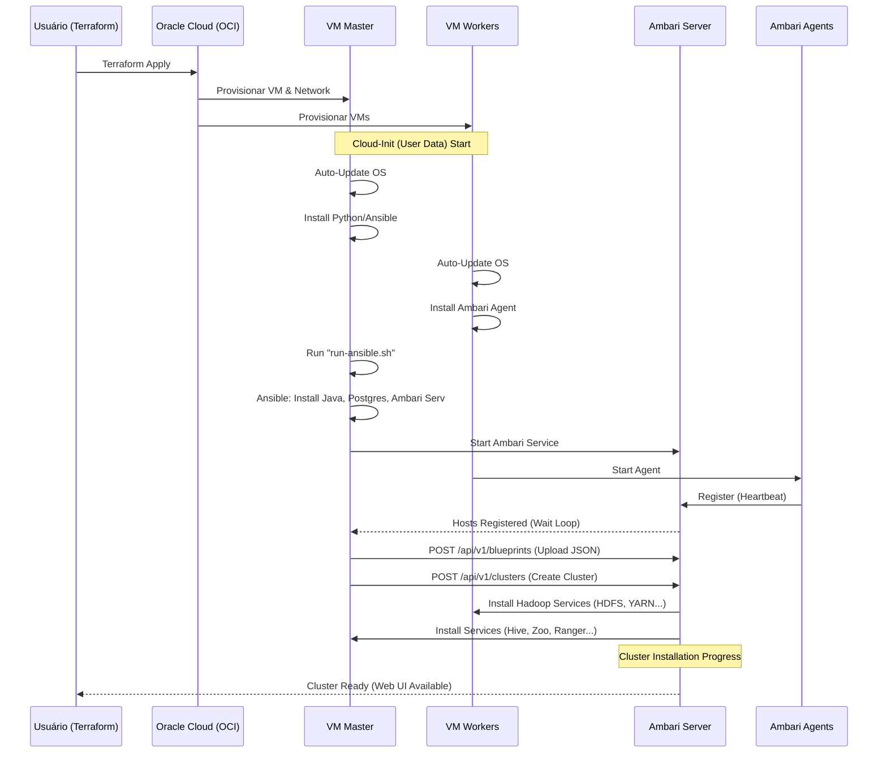
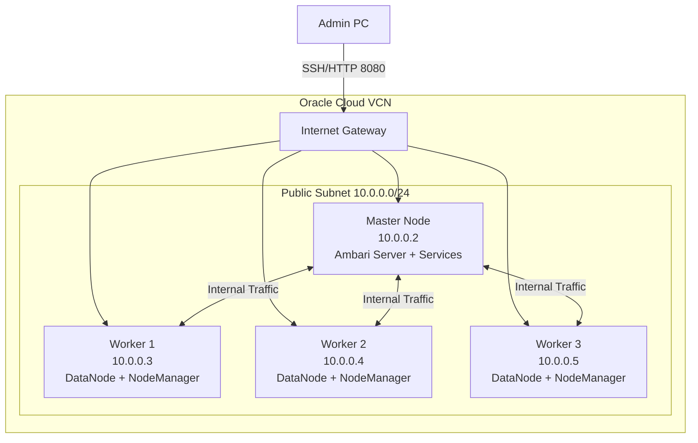

# 04 - Arquitetura e Fluxo de Automação

##  Fluxo de Provisionamento (End-to-End)

O diagrama abaixo ilustra todo o processo desde o comando `terraform apply` até o cluster estar operacional.

##  Topologia da Infraestrutura

##  Fluxo de Dados de Configuração

1.  **Local Machine**: `blueprint.json` e `*.tf`
2.  **Transferência**: Terraform `file provisioner` envia arquivos para `/root` no Master.
3.  **Processamento**: Ansible lê variáveis e arquivos locais do Master.
4.  **Aplicação**: Ambari lê Blueprint e distribui configurações para os Agents nos nós.
