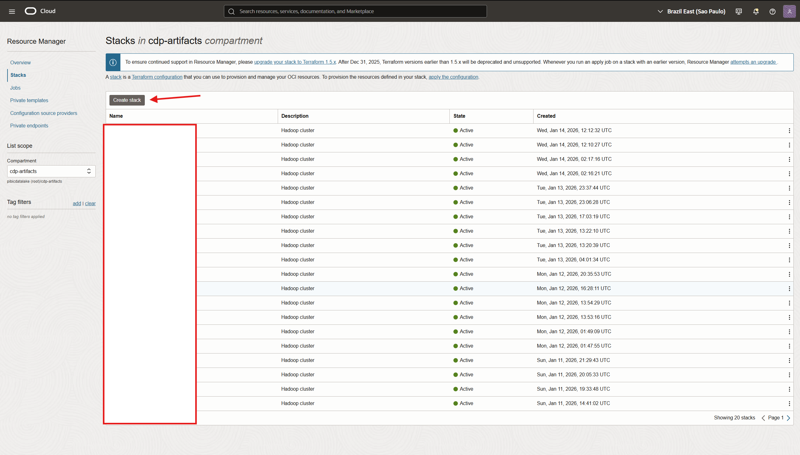
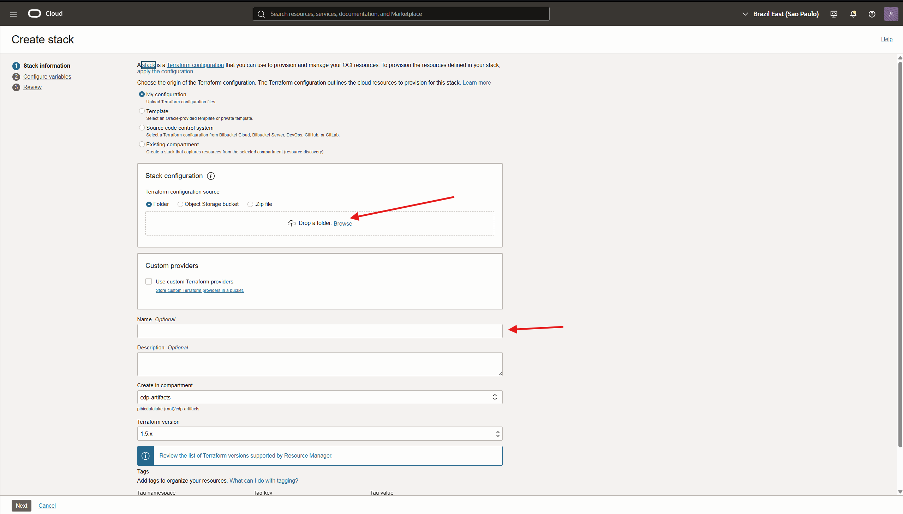
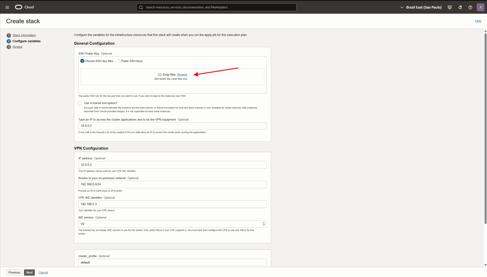
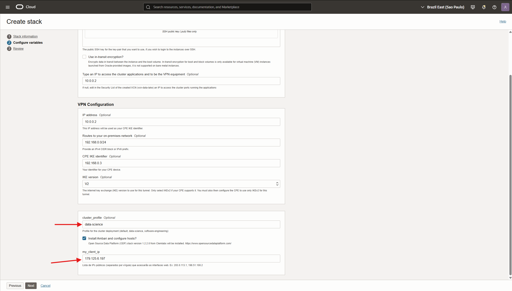
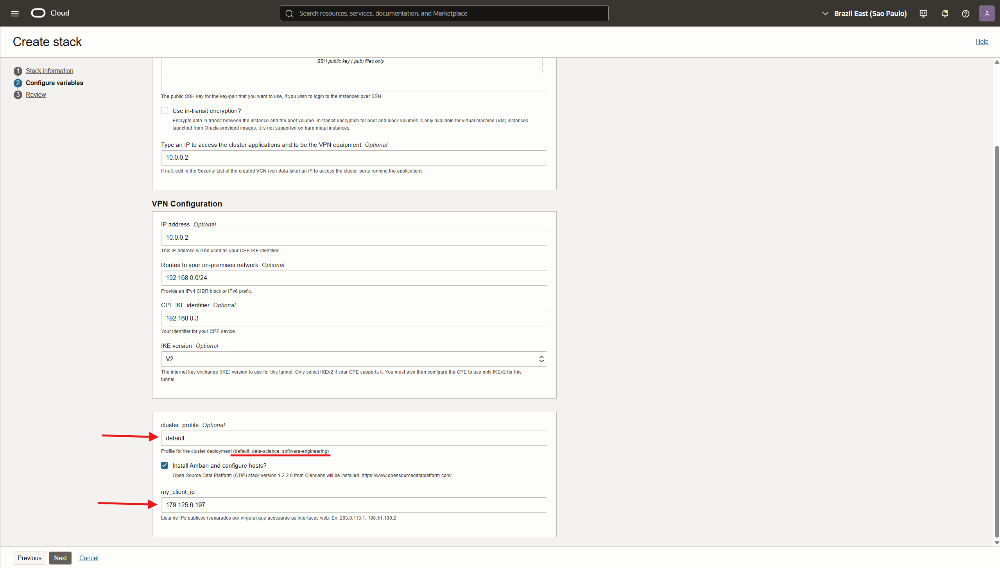
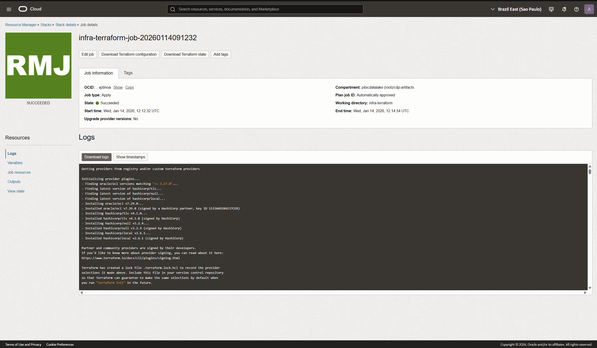

# 07 - Guia de Deploy via OCI Stacks (Resource Manager)

A maneira recomendada de realizar o deploy deste projeto na Oracle Cloud é utilizando o serviço **Resource Manager (Stacks)**. Isso permite que você faça upload do código Terraform e utilize uma interface gráfica amigável para configurar as variáveis, sem precisar instalar o Terraform localmente ou rodar comandos no terminal.

##  Pré-requisitos

1.  Uma conta ativa na Oracle Cloud.
2.  Um **Compartment** criado para o projeto.
3.  O código fonte do projeto (pasta `infra-terraform-main`) compactado em um arquivo `.zip`.

---

##  Passo a Passo

### 1. Preparar o Pacote
Acesse [infra-terraform-main](https://github.com/Ecosystem-CDP/infra-terraform-main) e faça o download do arquivo `infra-terraform-main.zip`. Extraia o arquivo e o use como stack para o procedimento que vem a seguir.

### 2. Criar a Stack
1.  Faça login no Console da OCI.
2.  No menu de navegação, vá para **Developer Services** > **Resource Manager** > **Stacks**.
3.  Selecione o **Compartment** correto.
4.  Clique em **Create Stack**.
5.  **1. Stack Information**:
    *   Selecione **My Configuration**.
    *   **Terraform configuration source**: Selecione `.Zip file`.
    *   Faça upload do seu arquivo `.zip`.
    *   **Name**: Dê um nome, ex: `CDP-Data-Lake`.
    *   Clique em **Next**.

### 3. Configurar Variáveis
Graças ao arquivo `schema.yaml` incluído no projeto, o OCI irá gerar um formulário customizado. Preencha os campos:

#### General Configuration
*   **SSH Public Key**: Cole o conteúdo da sua chave pública (`id_rsa.pub`). Isso é essencial para acessar as máquinas depois.
*   **Use in-transit encryption?**: (Opcional) Marque se desejar criptografia em trânsito.
*   **Install Ambari...?**: (Marcado por padrão) Garante que o cluster será instalado automaticamente.
*   **Type an IP to access...**: Insira o seu IP público (verifique em [whatismyip.com](https://whatismyip.com)) para liberar o acesso ao firewall.

#### VPN Configuration
*   (Opcional) Preencha apenas se for configurar uma VPN Site-to-Site com sua rede on-premises. Caso contrário, pode ignorar ou deixar os valores padrão se não forem obrigatórios.

Clique em **Next**.

### 4. Review e Deploy
1.  Revise as configurações na tela final.
2.  Marque a opção **Run Apply** na parte inferior se quiser que o deploy comece imediatamente.
3.  Clique em **Create**.

---

##  Acompanhando o Deploy (Jobs)

Após criar a Stack, você será redirecionado para a página de **Job Details**.

1.  O OCI irá executar o `terraform apply`.
2.  Acompanhe os logs em tempo real na seção **Logs**.
3.  O processo levará cerca de **25 a 45 minutos** (pois inclui a instalação do Ambari e provisionamento do cluster Hadoop).
4.  Ao final, se tudo der certo, o status do Job ficará verde (**Succeeded**).

##  Destruindo o Ambiente
Para apagar tudo e parar a cobrança:
1.  Vá na página da Stack.
2.  Clique em **Destroy**.
3.  Confirme a ação. O OCI irá rodar o `terraform destroy` para você.
