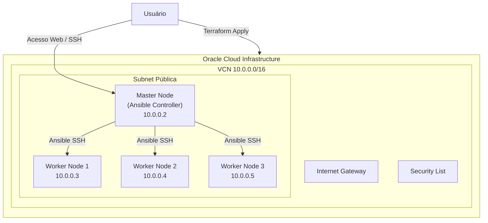
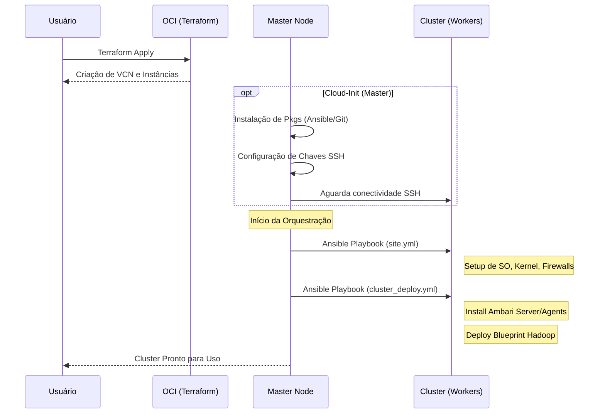

# CDP Infrastructure on OCI (Terraform + Ansible)

**Documentação Principal:** [https://github.com/Ecosystem-CDP/docs/tree/main](https://github.com/Ecosystem-CDP/docs/tree/main)

---

**Vídeo demonstrativo do processo de Deploy:** [Tutorial para deploy de um Cluster Hadoop na OCI](https://youtu.be/MbpKeu-Jw_Y)

Este projeto automatiza o deploy completo de um cluster Hadoop em nuvem, utilizando a Oracle Cloud Infrastructure (OCI). O objetivo é fornecer uma "Stack" pronta para uso que provisiona um Data Lake completo baseado em metadados (Blueprints), utilizando instâncias ARM (Ampere) com Oracle Linux 9.

## Objetivo

Criar um framework de infraestrutura como código que permite a qualquer usuário instanciar um cluster Big Data funcional apenas registrando esta stack no OCI Resource Manager ou executando via Terraform CLI. O projeto vai além do provisionamento de máquinas, entregando o software (Ambari/Hadoop) instalado e configurado.

## Arquitetura

O projeto combina **Terraform** para a infraestrutura física e de rede, com **Ansible** (executado via **Cloud-Init**) para a configuração de software e orquestração do cluster.

### Componentes de Infraestrutura (Terraform)
*   **OCI Core**: VCN, Subnets, Internet Gateways, Security Lists.
*   **Compute Instances**:
    *   **1 Master Node** (`master.cdp`): Responsável por gerenciar o cluster e executar o Ansible.
    *   **3 Worker Nodes** (`node1.cdp`, `node2.cdp`, `node3.cdp`): Nós de processamento e armazenamento.
*   **SO**: Oracle Linux 9 (Arquitetura Aarch64/Ampere).
*   **Network**: Rede privada interna `10.0.0.x` para comunicação do cluster.

### Fluxo de Provisionamento

1.  **Terraform**:
    *   Cria a infraestrutura de rede e segurança.
    *   Sobe as instâncias VM.
    *   Gera chaves SSH dinâmicas para comunicação entre nós.
    *   Faz o upload dos *assets* (Playbooks, Blueprint, Templates) para o nó Master via provisionador `file`.
2.  **Cloud-Init (Master)**:
    *   Configura o ambiente inicial.
    *   Instala dependências (Python, Ansible, Git).
    *   Aguarda a disponibilidade dos Worker nodes (SSH check).
    *   Dispara o script de orquestração `run-ansible.sh`.
3.  **Ansible (Master -> Cluster)**:
    *   **Infra Setup** (`site.yml`): Prepara o SO, ajusta kernel, firewalls e pré-requisitos do Ambari em todos os nós.
    *   **Cluster Deploy** (`cluster_deploy.yml`): Instala o Ambari Server, Ambari Agents e realiza o deploy dos serviços Hadoop conforme definido no `blueprint.json`.

## Configuração Obrigatória

### Variável: `my_client_ip`
Para garantir a segurança do acesso às interfaces web (Ambari, NiFi, Zeppelin, etc.), é **obrigatório** fornecer o seu endereço IP público atual. O Terraform utilizará este IP para criar regras de Security List específicas, permitindo o tráfego apenas da sua origem.

*   **Descrição**: Lista de IPs públicos da sua máquina (notebook/desktop) separados por vírgula.
*   **Como obter**: Acesse [https://api.ipify.org](https://api.ipify.org) ou [https://whatismyip.com](https://whatismyip.com).
*   **Exemplo**: `203.0.113.15, 198.51.100.12`

## Visão Geral dos Arquivos
*   `compute.tf`: Definição das VMs e *User Data* (Cloud-Init).
*   `network.tf`: Configuração de VCN e rede.
*   `provider.tf`: Configuração do OCI Provider.
*   `cloud-init/`: Scripts de inicialização YAML (Master e Workers).
*   `assets/`:
    *   `blueprint.json`: Definição completa dos serviços Hadoop a serem instalados.
    *   `ODP-VDF.xml`: Definição de versão do stack (Version Definition File).
    *   `*.yml`: Playbooks do Ansible.
